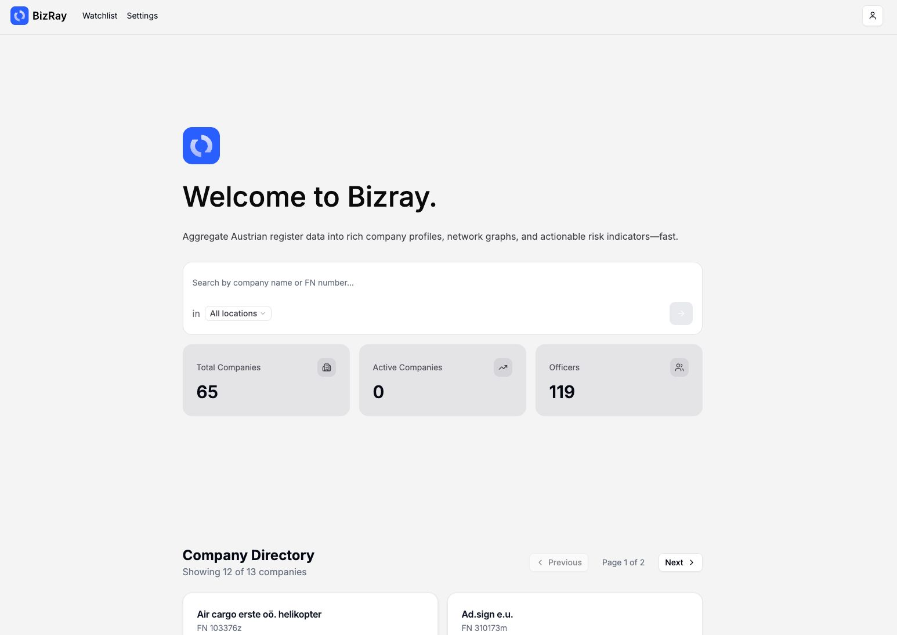
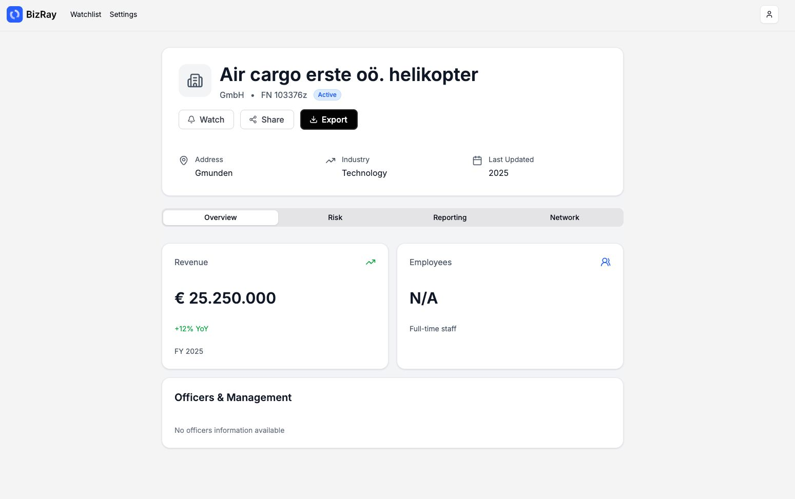
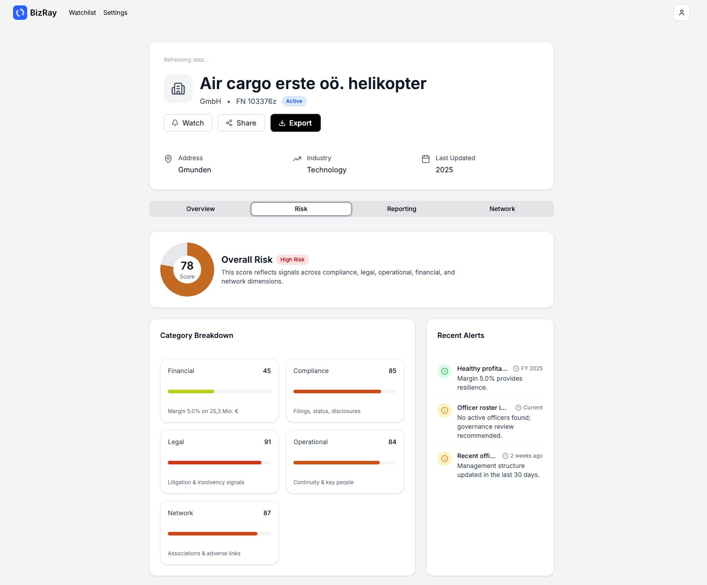
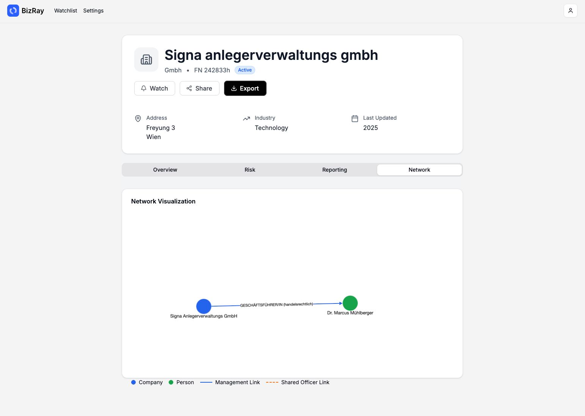

# BizRay Backend

FastAPI backend for Austrian Business Register (Firmenbuch) data management.

Description:
BizRay is a full-stack web application developed as part of the Software Engineering & Project Management course at IMC Krems. The platform provides a modern interface for visualizing and managing business-related data through interactive dashboards and analytics tools.

Tech Stack:

Frontend: React (with Tailwind CSS / shadcn UI)

Backend: Python (FastAPI)

Database: PostgreSQL / Supabase

Other tools: GitHub, PyCharm, Docker (optional for local deployment), and pytest for testing

Key Features:

- Interactive data visualization and filtering

- RESTful API for dynamic data exchange between frontend and backend

- Secure authentication and session handling

- Modular architecture for scalability and maintainability

- Team-based development using Agile/Scrum methodology

Team Role (Schultz David):

Developed backend routes and API integration in Python (FastAPI)

Integrated frontend communication with backend endpoints

Assisted in UI/UX design and documentation

Maintained version control and project structure on GitHub

Purpose:
The project demonstrates the integration of frontend, backend, and database layers in a single web-based analytics platform. It simulates a real-world software development workflow, emphasizing teamwork, code quality, and documentation.







## Setup

### Prerequisites

- Python 3.9+
- Supabase account and database
- pip or poetry for package management

### Installation

1. Install dependencies:

```bash
pip install -r requirements.txt
```

2. Create a `.env` file based on `.env.example`:

```bash
cp .env.example .env
```

3. Update `.env` with your Supabase and Firmenbuch credentials:

```
SUPABASE_URL=https://your-project.supabase.co
SUPABASE_KEY=your-supabase-anon-key

# Firmenbuch API (required for remote fetch-on-miss in search)
# Set to the base URL of your Firmenbuch proxy/service. Do not include a trailing slash.
FIRMENBUCH_BASE_URL=https://api.justiz.gv.at
# Optional API key if your endpoint requires one
API_KEY=your-api-key
```

4. Run database migrations in Supabase:
   - Go to your Supabase dashboard
   - Navigate to SQL Editor
   - Copy and run the contents of `supabase/migrations/init.sql`

### Running the Application

#### Development Mode

```bash
cd backend
uvicorn backend.services.api.main:app --reload --port 8000
```

The API will be available at:

- API: http://localhost:8000
- Swagger UI: http://localhost:8000/docs
- ReDoc: http://localhost:8000/redoc

#### Production Mode

```bash
uvicorn backend.services.api.main:app --host 0.0.0.0 --port 8000
```

## API Endpoints

### Companies

- `GET /api/companies/` - List all companies
- `GET /api/companies/{id}` - Get company by ID (includes officers)
- `GET /api/companies/fnr/{fnr}` - Get company by Firmenbuch number
- `POST /api/companies/` - Create new company
- `PUT /api/companies/{id}` - Update company
- `DELETE /api/companies/{id}` - Delete company

### Officers

- `GET /api/officers/` - List all officers
- `GET /api/officers/{id}` - Get officer by ID
- `GET /api/officers/company/{company_id}` - Get officers by company
- `POST /api/officers/` - Create new officer
- `PUT /api/officers/{id}` - Update officer
- `DELETE /api/officers/{id}` - Delete officer

### Search

- `GET /api/search/?query={term}` - Search companies (falls back to Firmenbuch API when not found locally and persists the result)
- `POST /api/search/` - Search with advanced options

### Health

- `GET /health` - Health check endpoint
- `GET /` - API information

## Database Schema

### Tables

- **companies**: Company information (FN number, name, address, etc.)
- **officers**: Officer/director information
- **company_officers**: Junction table linking companies and officers
- **links**: Company relationships/connections

## Project Structure

```
backend/
├── services/
│   ├── api/
│   │   ├── main.py              # FastAPI application
│   │   ├── dependencies.py      # Dependency injection
│   │   └── routers/
│   │       ├── companies.py     # Company endpoints
│   │       ├── officers.py      # Officer endpoints
│   │       └── search.py        # Search endpoints
│   └── ingest/                  # Data ingestion services
├── shared/
│   ├── config.py                # Configuration
│   ├── models.py                # Pydantic models
│   └── utils.py                 # Utility functions
├── supabase/
│   ├── client.py                # Supabase client
│   ├── queries.py               # Database queries
│   └── migrations/
│       └── init.sql             # Database schema
└── requirements.txt             # Python dependencies
```

Notes:
- When `FIRMENBUCH_BASE_URL` is not set, search endpoints operate in DB-only mode and will not fetch from the remote API on cache miss.

## Development

### Running Tests

```bash
pytest tests/
```

### Troubleshooting

- Search returns no results and logs contain:
  `FIRMENBUCH_BASE_URL environment variable must be configured ...`
  → Ensure `FIRMENBUCH_BASE_URL` (and `API_KEY` if needed) are set in `backend/.env`, then restart `make dev`.

### Code Formatting

```bash
black backend/
```

### Linting

```bash
flake8 backend/
```

## API Documentation

Once the server is running, visit:

- Swagger UI: http://localhost:8000/docs
- ReDoc: http://localhost:8000/redoc

## License

MIT License
